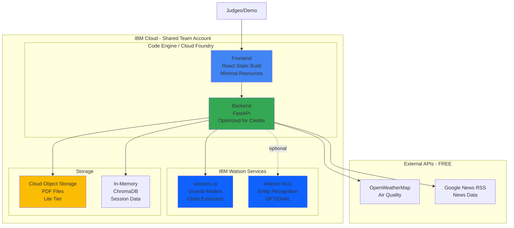

# IBM Bob Dev Day Hackathon - Deployment Guide

**Optimized for Shared IBM Cloud Account with Metered Credits**

This guide is specifically designed for the IBM Bob Dev Day Hackathon where teams receive a shared IBM Cloud account with pre-allocated credits for proof-of-concept deployment.

---

## 🎯 Hackathon Context

### What You Get
- **Shared IBM Cloud Account** (team-based, temporary)
- **watsonx.ai** - Foundation model inferencing
- **watsonx Orchestrate** (optional) - AI agents and workflows
- **IBM Cloud Runtime/Compute** - Containers, serverless functions
- **Storage** - Data and artifact persistence
- **Bob AI** - 40 Bobcoins per participant (individual, not pooled)

### Important Constraints
- ⏰ **Account is temporary** - De-provisioned after hackathon
- 💰 **Metered credits** - Sufficient for PoC, but monitor usage
- 👥 **Shared account** - Coordinate with teammates
- 🎯 **Focus on demo** - Optimize for judging presentation
- 📊 **Live deployment preferred** - Cloud deployment showcases better than local

---

## 🏗️ Recommended Architecture for Hackathon



### Key Design Decisions for Hackathon

1. **Use watsonx.ai** (Required) - Core AI functionality
2. **Skip Watson NLU** (Optional) - Save credits, use spaCy locally for entity extraction
3. **Minimal Storage** - Use Cloud Object Storage Lite tier or in-memory
4. **Optimize Resources** - Small instance sizes, scale-to-zero
5. **Cache Aggressively** - Reduce API calls during demos
6. **Test Locally First** - Deploy only when ready

---

## 📋 Pre-Deployment Checklist

### 1. Request IBM Cloud Account (Do This First!)
1. Go to hackathon portal: "Complete the Hackathon"
2. Click **"Request IBM Cloud account"** button
3. Wait for account provisioning (can take 1-2 hours)
4. Check email for account credentials
5. Login to verify access: [cloud.ibm.com](https://cloud.ibm.com)

### 2. Setup watsonx.ai (Required)
1. Login to [watsonx.ai](https://dataplatform.cloud.ibm.com/wx/home)
2. Create project: "ESG-Hackathon-[TeamName]"
3. Note your **Project ID** (Settings → General)
4. Create API key: [IBM Cloud API Keys](https://cloud.ibm.com/iam/apikeys)
5. Test access with a simple prompt

### 3. Setup External APIs (Free, No Credits Used)
**OpenWeatherMap:**
1. Sign up: [openweathermap.org](https://home.openweathermap.org/users/sign_up)
2. Get API key (free tier: 1K calls/day)
3. Test: `curl "http://api.openweathermap.org/data/2.5/air_pollution?lat=40.7128&lon=-74.0060&appid=YOUR_KEY"`

**Google News RSS:**
- No API key needed (public RSS feeds)
- Rate limit: 2 seconds between requests

### 4. Prepare Your Code
```bash
# Clone/navigate to your project
cd d:/codes/ibm/LENS

# Test locally first
cd backend
python -m venv venv
venv\Scripts\activate  # Windows
pip install -r requirements.txt

# Create .env file
copy .env.example .env
# Edit .env with your API keys

# Test backend
python -m app.main

# Test frontend (in new terminal)
cd ../frontend
npm install
npm run dev
```

---

## 🚀 Deployment Strategy (Credit-Optimized)

### Option A: Code Engine (Recommended for Hackathon)

**Pros:**
- ✅ Automatic buildpacks (no Dockerfile needed)
- ✅ Auto-scaling (including scale-to-zero)
- ✅ Built-in HTTPS
- ✅ Easy CLI deployment
- ✅ Good for demos

**Cons:**
- ⚠️ Uses more credits than Cloud Foundry
- ⚠️ Cold start delay (5-10 seconds)

**Best for:** Teams comfortable with containers, need auto-scaling

### Option B: Cloud Foundry (Most Credit-Efficient)

**Pros:**
- ✅ Lower credit consumption
- ✅ Faster cold starts
- ✅ Simple deployment
- ✅ Good for Python/Node.js apps

**Cons:**
- ⚠️ Requires buildpack configuration
- ⚠️ Less flexible than Code Engine

**Best for:** Teams wanting to maximize credits, simple apps

### Option C: Hybrid (Recommended)

**Strategy:**
- **Backend**: Cloud Foundry (runs continuously, lower cost)
- **Frontend**: Code Engine or Static hosting (minimal resources)
- **Storage**: Cloud Object Storage Lite tier

---

## 🎯 Step-by-Step Deployment (Code Engine)

### Phase 1: Setup (10 minutes)

#### 1.1 Install IBM Cloud CLI
```bash
# Already installed? Skip this
ibmcloud --version

# Windows: Download from https://cloud.ibm.com/docs/cli
# macOS: brew install ibmcloud-cli
# Linux: curl -fsSL https://clis.cloud.ibm.com/install/linux | sh

# Install Code Engine plugin
ibmcloud plugin install code-engine
```

#### 1.2 Login to Shared Account
```bash
# Login with your team's shared account credentials
ibmcloud login

# Or use SSO if provided
ibmcloud login --sso

# Target the region (check with your team)
ibmcloud target -r us-south -g Default

# Verify you're in the right account
ibmcloud target
```

#### 1.3 Create Code Engine Project
```bash
# Use team-specific naming to avoid conflicts
ibmcloud ce project create --name esg-team-[yourteamname]

# Select the project
ibmcloud ce project select --name esg-team-[yourteamname]

# Verify
ibmcloud ce project current
```

### Phase 2: Deploy Backend (15 minutes)

#### 2.1 Create Secrets (Credit-Free)
```bash
# Store API keys securely
ibmcloud ce secret create --name api-keys \
  --from-literal IBM_CLOUD_API_KEY=your_key_here \
  --from-literal IBM_WATSONX_PROJECT_ID=your_project_id_here \
  --from-literal OPENWEATHERMAP_API_KEY=your_key_here

# Verify
ibmcloud ce secret get --name api-keys
```

#### 2.2 Deploy Backend (Credit-Optimized)
```bash
cd backend

# Deploy with minimal resources to save credits
ibmcloud ce app create \
  --name esg-backend \
  --src . \
  --strategy buildpacks \
  --port 8080 \
  --min-scale 0 \
  --max-scale 1 \
  --cpu 0.5 \
  --memory 1G \
  --env-from-secret api-keys \
  --env WATSONX_URL=https://us-south.ml.cloud.ibm.com \
  --env WATSONX_EXTRACTION_MODEL=ibm/granite-3-8b-instruct \
  --env WATSONX_EXPLANATION_MODEL=ibm/granite-3-8b-instruct \
  --env STORAGE_MODE=memory \
  --env UPLOAD_DIR=/tmp/uploads \
  --env LOG_LEVEL=INFO \
  --env CORS_ORIGINS=*

# Get backend URL
BACKEND_URL=$(ibmcloud ce app get --name esg-backend --output url)
echo "Backend: $BACKEND_URL"

# Test
curl $BACKEND_URL/
```

**Credit Optimization Tips:**
- `--min-scale 0` - Scales to zero when idle (saves credits)
- `--max-scale 1` - Limits concurrent instances
- `--cpu 0.5 --memory 1G` - Minimal resources
- `STORAGE_MODE=memory` - No persistent storage costs

### Phase 3: Deploy Frontend (10 minutes)

#### 3.1 Build Frontend Locally (Saves Build Credits)
```bash
cd ../frontend

# Create production env
echo "VITE_API_URL=${BACKEND_URL}/api/v1" > .env.production

# Build locally to save cloud build credits
npm install
npm run build

# Verify build
ls -la dist/
```

#### 3.2 Deploy Pre-Built Frontend
```bash
# Deploy the built files (faster, cheaper)
ibmcloud ce app create \
  --name esg-frontend \
  --src . \
  --strategy buildpacks \
  --port 8080 \
  --min-scale 0 \
  --max-scale 1 \
  --cpu 0.25 \
  --memory 512M \
  --env VITE_API_URL=${BACKEND_URL}/api/v1 \
  --build-command "npm install && npm run build" \
  --run-command "npm run preview -- --host 0.0.0.0 --port 8080"

# Get frontend URL
FRONTEND_URL=$(ibmcloud ce app get --name esg-frontend --output url)
echo "Frontend: $FRONTEND_URL"
```

#### 3.3 Update Backend CORS
```bash
# Allow frontend to access backend
ibmcloud ce app update \
  --name esg-backend \
  --env CORS_ORIGINS=${FRONTEND_URL}
```

### Phase 4: Verify Deployment (5 minutes)

```bash
# Test backend
curl ${BACKEND_URL}/
curl ${BACKEND_URL}/docs

# Test frontend
curl ${FRONTEND_URL}

# Open in browser
echo "🎉 Your app: ${FRONTEND_URL}"
```

---

## 💰 Credit Management Strategies

### Monitor Usage
```bash
# Check app status
ibmcloud ce app get --name esg-backend
ibmcloud ce app get --name esg-frontend

# View resource consumption
ibmcloud ce app get --name esg-backend --output json | jq '.status.resourceUsage'

# Check billing (if available)
ibmcloud billing account-usage
```

### Optimize During Hackathon

#### 1. Scale to Zero When Not Demoing
```bash
# Before breaks/overnight
ibmcloud ce app update --name esg-backend --min-scale 0
ibmcloud ce app update --name esg-frontend --min-scale 0

# Before demo (warm up)
ibmcloud ce app update --name esg-backend --min-scale 1
```

#### 2. Use Local Development
```bash
# Develop locally, deploy only for testing
cd backend
python -m app.main  # Local backend

cd frontend
npm run dev  # Local frontend
```

#### 3. Cache Demo Data
```python
# In backend, cache watsonx.ai responses
import json
from functools import lru_cache

@lru_cache(maxsize=100)
def extract_claims_cached(document_hash):
    # Cache results to avoid repeated API calls
    pass
```

#### 4. Limit watsonx.ai Usage
- Process only 5-10 pages per demo
- Use smaller test PDFs during development
- Cache extraction results
- Limit to 2-3 claims per document

#### 5. Batch External API Calls
```python
# Cache air quality data
from datetime import datetime, timedelta

air_quality_cache = {}

def get_air_quality(lat, lon):
    cache_key = f"{lat},{lon}"
    if cache_key in air_quality_cache:
        cached_time, data = air_quality_cache[cache_key]
        if datetime.now() - cached_time < timedelta(hours=1):
            return data
    
    # Fetch fresh data
    data = fetch_from_api(lat, lon)
    air_quality_cache[cache_key] = (datetime.now(), data)
    return data
```

---

## 🎬 Demo Preparation

### 1. Pre-Load Demo Data (Day Before)
```bash
# Upload test PDF
curl -X POST ${BACKEND_URL}/api/v1/upload \
  -F "file=@demo-report.pdf" \
  -F "company_name=Demo Corp"

# Extract claims (cache results)
curl -X POST ${BACKEND_URL}/api/v1/extract-claims \
  -H "Content-Type: application/json" \
  -d '{"document_id": "your-doc-id"}'
```

### 2. Warm Up Before Demo (15 minutes before)
```bash
# Wake up apps (avoid cold start during demo)
curl ${BACKEND_URL}/
curl ${FRONTEND_URL}

# Set min-scale to 1
ibmcloud ce app update --name esg-backend --min-scale 1
ibmcloud ce app update --name esg-frontend --min-scale 1
```

### 3. Demo Script (5-7 minutes)
1. **Introduction** (30 sec)
   - Show frontend URL
   - Explain the problem (greenwashing)

2. **Upload Document** (1 min)
   - Upload pre-prepared PDF
   - Show upload progress

3. **Extract Claims** (1 min)
   - Click "Extract Claims"
   - Show AI-extracted claims with confidence scores

4. **Verify Claims** (2 min)
   - Select a claim
   - Show external evidence (satellite, news, air quality)
   - Highlight map visualization

5. **Risk Score** (1 min)
   - Show overall risk score
   - Read AI-generated explanation
   - Highlight contradictions

6. **Q&A** (1-2 min)
   - Technical architecture
   - IBM services used
   - Future enhancements

### 4. Backup Plan
```bash
# If cloud fails, have local version ready
cd backend && python -m app.main &
cd frontend && npm run dev &

# Or have screenshots/video ready
```

---

## 🐛 Troubleshooting

### Issue: "Insufficient Credits"

**Check usage:**
```bash
ibmcloud billing account-usage
```

**Solutions:**
1. Scale down resources
2. Delete unused apps
3. Use local development
4. Contact hackathon organizers

### Issue: "App Not Starting"

**Check logs:**
```bash
ibmcloud ce app logs --name esg-backend --tail 100
```

**Common causes:**
- Missing API keys
- Wrong environment variables
- Build failures

**Solution:**
```bash
# Verify secrets
ibmcloud ce secret get --name api-keys

# Check env vars
ibmcloud ce app get --name esg-backend --output json | jq '.spec.template.spec.containers[0].env'

# Redeploy
ibmcloud ce app update --name esg-backend --src .
```

### Issue: "Cold Start During Demo"

**Prevention:**
```bash
# 15 minutes before demo
ibmcloud ce app update --name esg-backend --min-scale 1
ibmcloud ce app update --name esg-frontend --min-scale 1

# Warm up
curl ${BACKEND_URL}/
curl ${FRONTEND_URL}
```

### Issue: "CORS Errors"

**Solution:**
```bash
FRONTEND_URL=$(ibmcloud ce app get --name esg-frontend --output url)
ibmcloud ce app update --name esg-backend --env CORS_ORIGINS=${FRONTEND_URL}
```

---

## 🎯 Judging Criteria Alignment

### Technical Implementation (30%)
- ✅ **Live cloud deployment** (not just local)
- ✅ **IBM watsonx.ai integration** (core requirement)
- ✅ **External data sources** (satellite, news, air quality)
- ✅ **Clean architecture** (FastAPI + React)

### Innovation (25%)
- ✅ **Novel approach** (AI-powered greenwashing detection)
- ✅ **Real-world problem** (ESG verification)
- ✅ **Explainable AI** (transparent risk scoring)

### User Experience (20%)
- ✅ **Intuitive interface** (simple upload → results flow)
- ✅ **Visual evidence** (map, charts, explanations)
- ✅ **Fast response** (< 2 seconds per action)

### Business Value (15%)
- ✅ **Clear use case** (investor due diligence)
- ✅ **Scalable solution** (can handle multiple reports)
- ✅ **Cost-effective** (uses free/lite tier services)

### Presentation (10%)
- ✅ **Live demo** (cloud deployment)
- ✅ **Clear narrative** (problem → solution → impact)
- ✅ **Technical depth** (explain architecture)

---

## 📊 Resource Allocation Recommendations

### For 3-Day Hackathon

**Day 1: Development (Local)**
- Build features locally
- Test with sample data
- No cloud deployment yet
- **Credits used: 0**

**Day 2: Testing (Cloud)**
- Deploy to cloud for testing
- Run integration tests
- Fix bugs
- **Credits used: ~30%**

**Day 3: Demo Prep (Cloud)**
- Final deployment
- Demo rehearsals
- Keep apps running for judging
- **Credits used: ~70%**

### Credit Budget Breakdown

| Service | Estimated Usage | Credits |
|---------|----------------|---------|
| Code Engine (Backend) | 24 hours @ min resources | ~40% |
| Code Engine (Frontend) | 24 hours @ min resources | ~20% |
| watsonx.ai | 50 API calls | ~30% |
| Cloud Object Storage | 100 MB | ~5% |
| Network/Bandwidth | Minimal | ~5% |
| **Total** | | **100%** |

---

## 🔒 Security Best Practices

### 1. Protect API Keys
```bash
# Never commit .env files
echo ".env" >> .gitignore
echo ".env.production" >> .gitignore

# Use Code Engine secrets
ibmcloud ce secret create --name api-keys --from-literal KEY=value
```

### 2. Limit CORS
```bash
# After deployment, restrict CORS
ibmcloud ce app update --name esg-backend \
  --env CORS_ORIGINS=${FRONTEND_URL}
```

### 3. Coordinate with Team
- Share account credentials securely (team chat, not public)
- Use team-specific naming (avoid conflicts)
- Communicate before deploying/deleting

---

## 📞 Getting Help

### During Hackathon
1. **Mentors** - Ask at mentor desk
2. **Slack/Discord** - Post in #help channel
3. **IBM Support** - Contact hackathon organizers
4. **Documentation** - [IBM Cloud Docs](https://cloud.ibm.com/docs)

### Quick Reference
```bash
# View all apps
ibmcloud ce app list

# View logs
ibmcloud ce app logs --name esg-backend --follow

# Restart app
ibmcloud ce app update --name esg-backend --env RESTART=true

# Delete app (free up credits)
ibmcloud ce app delete --name esg-backend

# Check project
ibmcloud ce project current
```

---

## ✅ Final Checklist

### Before Judging
- [ ] Apps deployed and running
- [ ] Frontend URL accessible
- [ ] Backend API responding
- [ ] Test PDF uploaded and working
- [ ] Claims extraction tested
- [ ] External data sources working
- [ ] Map visualization displaying
- [ ] Risk score calculating
- [ ] Apps warmed up (min-scale 1)
- [ ] Demo script practiced
- [ ] Backup plan ready
- [ ] Team coordinated

### During Demo
- [ ] Show live cloud deployment
- [ ] Explain IBM services used
- [ ] Highlight AI capabilities
- [ ] Show external data integration
- [ ] Demonstrate risk scoring
- [ ] Answer technical questions
- [ ] Stay within time limit

### After Hackathon
- [ ] Save screenshots/video
- [ ] Export code to GitHub
- [ ] Document learnings
- [ ] Thank mentors/organizers
- [ ] Clean up cloud resources (optional, will be de-provisioned)

---

## 🎉 Success Metrics

After deployment, you should have:

✅ **Live URLs**: Backend and frontend accessible  
✅ **Working Demo**: Upload → Extract → Verify → Score  
✅ **IBM Integration**: watsonx.ai powering AI features  
✅ **External Data**: Satellite, news, air quality working  
✅ **Visual Evidence**: Map and charts displaying  
✅ **Fast Performance**: < 2 second response times  
✅ **Credit Efficient**: Within allocated budget  
✅ **Team Ready**: Coordinated for judging  

---

## 📚 Additional Resources

### Hackathon Guide
- [Official Hackathon Guide PDF](https://watsonx-hackathons-2026.s3.us.cloud-object-storage.appdomain.cloud/IBM-Bob-Dev-Day-hackathon-guide.pdf)

### IBM Documentation
- [Code Engine Docs](https://cloud.ibm.com/docs/codeengine)
- [watsonx.ai Docs](https://www.ibm.com/docs/en/watsonx-as-a-service)
- [Cloud Foundry Docs](https://cloud.ibm.com/docs/cloud-foundry-public)

### Your Project Docs
- [`IBM_CLOUD_DEPLOYMENT_PLAN.md`](IBM_CLOUD_DEPLOYMENT_PLAN.md) - Full production guide
- [`DEPLOYMENT_GUIDE_FREE_TIER.md`](DEPLOYMENT_GUIDE_FREE_TIER.md) - Free tier guide
- [`README.md`](README.md) - Project overview
- [`API_KEYS_GUIDE.md`](API_KEYS_GUIDE.md) - API setup

---

**Ready for the hackathon? Follow this guide and you'll have a winning demo! 🏆**

**Questions?** Ask your mentors or check the hackathon Slack channel.

---

**Document Version**: 1.0 (Hackathon Edition)  
**Last Updated**: 2026-05-03  
**Target**: IBM Bob Dev Day Hackathon Teams  
**Deployment Time**: ~40 minutes  
**Credit Usage**: Optimized for shared account  
**Difficulty**: Intermediate