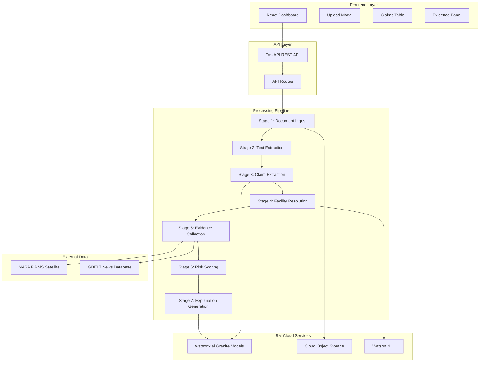

# ESG Claim Verification Assistant - Workflow & Implementation Corpus

## 📋 Table of Contents

1. [Project Overview](#project-overview)
2. [System Architecture](#system-architecture)
3. [Detailed Workflow](#detailed-workflow)
4. [Implementation Details](#implementation-details)
5. [Technology Stack](#technology-stack)
6. [Data Flow](#data-flow)
7. [API Endpoints](#api-endpoints)
8. [Service Modules](#service-modules)
9. [Frontend Components](#frontend-components)
10. [Deployment Architecture](#deployment-architecture)

---

## 🎯 Project Overview

### Purpose
The ESG Claim Verification Assistant is an AI-powered greenwashing risk detection tool that verifies corporate sustainability claims against publicly available satellite and news data.

### Problem Statement
Companies make environmental claims in sustainability reports that are difficult to verify. Manual verification is time-consuming and requires expertise in multiple domains (satellite data, news analysis, ESG reporting).

### Solution
An automated system that:
- Extracts ESG claims from PDF reports using AI
- Cross-references claims with satellite thermal anomaly data
- Analyzes news sentiment for environmental issues
- Produces transparent, explainable risk scores
- Generates natural language explanations

### Key Innovation
Combines multiple data sources (AI, satellite, news) to provide objective verification of corporate sustainability claims in under 60 seconds.

---

## 🏗️ System Architecture



---

## 🔄 Detailed Workflow

### Stage 1: Document Ingest
**Purpose:** Upload and store sustainability report PDF

**Process:**
1. User uploads PDF through frontend
2. Backend validates file type and size
3. File saved locally and uploaded to IBM Cloud Object Storage
4. Document metadata created with unique ID
5. Metadata stored in COS for tracking

**Technologies:**
- FastAPI multipart/form-data handling
- IBM Cloud Object Storage (boto3 SDK)

**Output:** Document ID, file URL, upload status

---

### Stage 2: Text Extraction & Chunking
**Purpose:** Extract text from PDF and identify ESG-relevant sections

**Process:**
1. Download PDF from Cloud Object Storage
2. Extract text using PyMuPDF (fitz)
3. Parse page-by-page with line numbers
4. Identify "candidate chunks" containing ESG keywords
5. Store extracted text and chunks in COS

**ESG Keywords Detected:**
- carbon, emissions, scope 1, scope 2, scope 3
- greenhouse gas, GHG, CO2, methane
- renewable, energy, electricity
- net-zero, carbon neutral, offset
- facility, plant, manufacturing, operations

**Technologies:**
- PyMuPDF (fitz) for PDF parsing
- pdfplumber as backup parser
- Regex for keyword detection

**Output:** Structured text with page numbers, candidate chunks

---

### Stage 3: ESG Claim Extraction
**Purpose:** Use AI to extract structured claims from text

**Process:**
1. Load candidate chunks from COS
2. For each chunk (max 5 to conserve quota):
   - Format prompt with extraction instructions
   - Call IBM watsonx.ai Granite 13B Instruct v2
   - Parse JSON response with claim details
   - Filter claims by confidence threshold (≥0.6)
3. Store extracted claims in COS

**Claim Structure:**
```json
{
  "claim_id": "uuid_claim_0",
  "claim_text": "Reduced Scope 1 emissions by 25% in 2023",
  "claim_type": "emissions_reduction",
  "value": 25.0,
  "unit": "percent",
  "year": 2023,
  "target_or_achieved": "achieved",
  "page_number": 12,
  "confidence": 0.92
}
```

**Claim Types:**
- emissions_reduction
- net_zero_target
- renewable_energy
- scope_1, scope_2, scope_3
- energy_efficiency
- carbon_offset

**Technologies:**
- IBM watsonx.ai Granite 13B Instruct v2
- Structured prompt engineering
- JSON parsing with error handling

**Output:** List of structured claims with confidence scores

---

### Stage 4: Facility Resolution
**Purpose:** Identify and geolocate facilities mentioned in claims

**Process:**
1. Load claims from COS
2. Extract entities using IBM Watson NLU:
   - Locations (cities, countries)
   - Organizations (company names)
   - Facilities (plants, factories)
   - Keywords (facility-related terms)
3. Match extracted entities against facility mapping database
4. Resolve facility names to geographic coordinates
5. Store resolved locations

**Entity Types Extracted:**
- Location entities (cities, regions)
- Organization entities (company names)
- Facility entities (plants, sites)
- Keywords containing facility terms

**Technologies:**
- IBM Watson Natural Language Understanding
- Entity extraction with sentiment disabled
- Fuzzy matching for facility resolution

**Output:** Facility locations with lat/long coordinates

---

### Stage 5: External Evidence Collection
**Purpose:** Query external data sources for verification signals

**Process:**

#### NASA FIRMS Query
1. For each resolved facility location:
   - Query NASA FIRMS API with lat/long + 50km radius
   - Search past 90 days for thermal anomalies
   - Count high-confidence detections
   - Create evidence record with signal strength

**Signal Types:**
- `thermal_anomaly` - Detected fires/heat sources
- `no_anomaly` - No thermal activity detected

#### GDELT Query
1. For each claim:
   - Build search query with facility + company name
   - Add environmental keywords (emissions, pollution, violation)
   - Query GDELT Doc API for past 90 days
   - Analyze article tone (negative threshold: <-2)
   - Count negative environmental coverage

**Signal Types:**
- `negative_news` - Significant negative coverage
- `neutral_news` - Mostly neutral coverage

**Technologies:**
- httpx async HTTP client
- NASA FIRMS VIIRS/MODIS satellite data
- GDELT 2.0 Doc API
- Tone analysis for sentiment

**Output:** Evidence records with source attribution and signal strength

---

### Stage 6: Risk Scoring
**Purpose:** Calculate transparent, explainable risk score

**Scoring Algorithm:**
```
Starting Score: 100 points

Penalties (per claim):
- Evidence Mismatch: -35 points
  (External signals contradict claim)
  
- Location Signal: -25 points
  (Thermal anomalies or unresolved location)
  
- Negative News: -20 points
  (Significant negative coverage)
  
- Missing Verification: -20 points
  (No external evidence found)

Final Score: Average of all claim scores
```

**Risk Bands:**
- 0-30: High Risk (Red)
- 31-60: Medium Risk (Yellow)
- 61-100: Low Risk (Green)

**Process:**
1. Load claims and evidence from COS
2. For each claim:
   - Check for evidence mismatches
   - Evaluate location signals
   - Assess news sentiment
   - Verify evidence availability
   - Calculate claim score
3. Average all claim scores
4. Determine risk band
5. Generate reasoning text

**Technologies:**
- Pure Python scoring logic
- Transparent heuristic algorithm
- No black-box AI in scoring

**Output:** Risk score with detailed breakdown per claim

---

### Stage 7: Explanation Generation
**Purpose:** Generate natural language explanation of findings

**Process:**
1. Load claims and evidence from COS
2. Format data for AI prompt
3. Call IBM watsonx.ai Granite 3.0 8B Instruct
4. Generate 3-bullet explanation:
   - Cite specific claims and evidence
   - Use neutral, factual language
   - Focus on verification status
5. Update risk score with explanation

**Explanation Guidelines:**
- Cite specific claims and external signals
- Avoid accusatory language
- Focus on what was verified/not verified
- Highlight inconsistencies factually

**Technologies:**
- IBM watsonx.ai Granite 3.0 8B Instruct
- Structured prompt engineering
- Temperature: 0.3 for consistency

**Output:** 3-bullet natural language explanation

---

## 💻 Implementation Details

### Backend Structure

```
backend/
├── app/
│   ├── api/
│   │   └── routes.py          # 4 REST endpoints
│   ├── models/
│   │   └── schemas.py         # Pydantic data models
│   ├── services/
│   │   ├── pdf_extractor.py   # Stage 2
│   │   ├── watsonx_service.py # Stages 3 & 7
│   │   ├── nlu_service.py     # Stage 4
│   │   ├── external_data_service.py # Stage 5
│   │   ├── scoring_service.py # Stage 6
│   │   └── storage_service.py # IBM COS wrapper
│   ├── config.py              # Settings management
│   └── main.py                # FastAPI application
```

### Key Design Patterns

**Singleton Services:**
- Each service module uses singleton pattern
- Prevents multiple API client initializations
- Reduces memory footprint

**Async Processing:**
- FastAPI async endpoints
- httpx async HTTP client for external APIs
- Concurrent evidence collection

**Error Handling:**
- Try-catch blocks in all service methods
- Structured logging with context
- Graceful degradation (continue on partial failures)

**Data Persistence:**
- All intermediate results stored in COS
- Enables debugging and caching
- Supports resume on failure

---

## 🛠️ Technology Stack

### Backend Technologies

| Technology | Version | Purpose |
|------------|---------|---------|
| Python | 3.11+ | Core language |
| FastAPI | 0.109.0 | Web framework |
| Uvicorn | 0.27.0 | ASGI server |
| Pydantic | 2.5.3 | Data validation |
| ibm-watsonx-ai | 0.2.6 | Granite models |
| ibm-cos-sdk | 2.13.4 | Object storage |
| ibm-watson | 8.0.0 | Watson NLU |
| PyMuPDF | 1.23.8 | PDF parsing |
| httpx | 0.26.0 | Async HTTP |

### Frontend Technologies

| Technology | Version | Purpose |
|------------|---------|---------|
| React | 18.2.0 | UI framework |
| Vite | 5.0.0 | Build tool |
| Tailwind CSS | 3.4.0 | Styling |
| Axios | 1.6.0 | HTTP client |

### Infrastructure

| Technology | Purpose |
|------------|---------|
| Docker | Containerization |
| IBM Code Engine | Serverless hosting |
| IBM Container Registry | Image storage |

---

## 📊 Data Flow

### Request Flow
```
1. User uploads PDF
   ↓
2. POST /api/v1/upload
   ↓
3. File saved to COS
   ↓
4. POST /api/v1/extract-claims
   ↓
5. Text extracted → Claims extracted (watsonx.ai)
   ↓
6. POST /api/v1/verify
   ↓
7. Facilities resolved (NLU) → Evidence collected (FIRMS + GDELT)
   ↓
8. POST /api/v1/score
   ↓
9. Risk calculated → Explanation generated (watsonx.ai)
   ↓
10. Results displayed in UI
```

### Data Storage Structure in COS

```
esg-lens-hackathon/
├── uploads/
│   └── {document_id}.pdf
├── metadata/
│   └── {document_id}.json
├── text/
│   └── {document_id}.json
├── claims/
│   └── {document_id}.json
├── evidence/
│   └── {document_id}.json
└── reports/
    └── {document_id}.json
```

---

## 🔌 API Endpoints

### POST /api/v1/upload
**Purpose:** Upload sustainability report PDF

**Request:**
```
Content-Type: multipart/form-data
- file: PDF file
- company_name: string
```

**Response:**
```json
{
  "document_id": "uuid",
  "filename": "report.pdf",
  "file_url": "https://...",
  "status": "uploaded",
  "message": "Document uploaded successfully"
}
```

---

### POST /api/v1/extract-claims
**Purpose:** Extract ESG claims from document

**Request:**
```
?document_id=uuid
```

**Response:**
```json
{
  "document_id": "uuid",
  "claims": [
    {
      "claim_id": "uuid_claim_0",
      "claim_text": "Reduced Scope 1 emissions by 25%",
      "claim_type": "emissions_reduction",
      "value": 25.0,
      "unit": "percent",
      "year": 2023,
      "target_or_achieved": "achieved",
      "page_number": 12,
      "confidence": 0.92
    }
  ],
  "total_claims": 5,
  "status": "claims_extracted"
}
```

---

### POST /api/v1/verify
**Purpose:** Collect external evidence for claims

**Request:**
```
?document_id=uuid
```

**Response:**
```json
{
  "document_id": "uuid",
  "evidence": [
    {
      "evidence_id": "uuid_claim_0_firms",
      "claim_id": "uuid_claim_0",
      "source": "NASA_FIRMS",
      "signal_type": "thermal_anomaly",
      "signal_text": "Detected 3 thermal anomalies within 50km",
      "signal_strength": 0.3,
      "timestamp": "2024-01-15T10:30:00Z"
    }
  ],
  "total_evidence": 8,
  "status": "verification_complete"
}
```

---

### POST /api/v1/score
**Purpose:** Calculate risk score and generate explanation

**Request:**
```
?document_id=uuid
```

**Response:**
```json
{
  "document_id": "uuid",
  "risk_score": {
    "truth_score": 65,
    "risk_band": "Medium Risk",
    "claim_breakdown": [
      {
        "claim_id": "uuid_claim_0",
        "claim_text": "Reduced Scope 1 emissions...",
        "score": 65,
        "flags": ["Evidence contradicts claim"],
        "evidence_count": 2
      }
    ],
    "reasoning": "• Claim about 25% emissions reduction contradicted by thermal anomalies\n• Facility location verified\n• Moderate negative news coverage detected",
    "generated_at": "2024-01-15T10:35:00Z"
  },
  "status": "scoring_complete"
}
```

---

## 🧩 Service Modules

### PDFExtractor Service
**File:** `backend/app/services/pdf_extractor.py`

**Responsibilities:**
- Extract text from PDF files
- Parse page-by-page with line numbers
- Identify ESG-relevant chunks
- Handle various PDF formats

**Key Methods:**
- `process_pdf(file_path)` - Main extraction method
- `extract_text_with_fitz(file_path)` - PyMuPDF extraction
- `identify_candidate_chunks(pages)` - ESG keyword filtering

---

### WatsonxService
**File:** `backend/app/services/watsonx_service.py`

**Responsibilities:**
- Initialize watsonx.ai clients
- Extract claims using Granite 13B
- Generate explanations using Granite 8B
- Parse JSON responses

**Key Methods:**
- `extract_claims_from_chunk(chunk_text, page_number, document_id)`
- `generate_explanation(claims, evidence)`
- `_parse_json_response(response)` - Handle various JSON formats

---

### NLUService
**File:** `backend/app/services/nlu_service.py`

**Responsibilities:**
- Extract entities from text
- Identify facility names
- Resolve facilities to coordinates
- Match against facility mapping

**Key Methods:**
- `extract_entities(text)` - NLU entity extraction
- `identify_facilities_in_claims(claims, full_text)`
- `resolve_facility_location(facility_name, mapping)`

---

### ExternalDataService
**File:** `backend/app/services/external_data_service.py`

**Responsibilities:**
- Query NASA FIRMS for thermal anomalies
- Query GDELT for news coverage
- Collect evidence for claims
- Analyze signal strength

**Key Methods:**
- `query_nasa_firms(lat, lon, radius_km, days_back)`
- `query_gdelt(facility_name, company_name, days_back)`
- `collect_evidence_for_claim(claim, facility_location)`

---

### ScoringService
**File:** `backend/app/services/scoring_service.py`

**Responsibilities:**
- Calculate risk scores
- Apply penalty weights
- Determine risk bands
- Generate reasoning text

**Key Methods:**
- `calculate_risk_score(document_id, claims, evidence)`
- `_check_evidence_mismatch(claim, evidence)`
- `_check_location_signals(claim, evidence)`
- `_check_news_signals(evidence)`

---

### StorageService
**File:** `backend/app/services/storage_service.py`

**Responsibilities:**
- Upload/download files to/from COS
- Store/retrieve JSON data
- List and delete objects
- Check object existence

**Key Methods:**
- `upload_file(file_path, object_key)`
- `download_file(object_key, local_path)`
- `upload_json(data, object_key)`
- `download_json(object_key)`

---

## 🎨 Frontend Components

### App.jsx
**Main application component**

**State Management:**
- Document ID and company name
- Claims list and selected claim
- Evidence list
- Risk score
- Loading states and errors

**Workflow:**
1. User uploads document
2. Sequential API calls (upload → extract → verify → score)
3. Display results in three-pane layout
4. Handle loading and error states

---

### UploadModal.jsx
**File upload interface**

**Features:**
- Drag-and-drop support
- File validation (PDF only, max 50MB)
- Company name input
- Upload progress indication

---

### ClaimsTable.jsx
**Claims display and selection**

**Features:**
- List all extracted claims
- Show claim type and confidence
- Highlight selected claim
- Color-coded confidence scores
- Click to select claim

---

### EvidencePanel.jsx
**Evidence and explanation display**

**Features:**
- Show evidence for selected claim
- Display source attribution (FIRMS/GDELT)
- Signal strength indicators
- AI-generated explanation
- Risk score breakdown

---

## 🚀 Deployment Architecture

### Local Development
```
Frontend (localhost:3000)
    ↓ HTTP
Backend (localhost:8000)
    ↓ HTTPS
IBM Cloud Services
    ↓ HTTPS
External APIs (FIRMS, GDELT)
```

### Production (IBM Cloud Code Engine)
```
User Browser
    ↓ HTTPS
IBM Code Engine (Frontend)
    ↓ Internal
IBM Code Engine (Backend API)
    ↓ HTTPS
IBM Cloud Services (watsonx.ai, COS, NLU)
    ↓ HTTPS
External APIs (FIRMS, GDELT)
```

### Containerization
- Backend: Python 3.11 slim image
- Frontend: Node.js build → Nginx serve
- Multi-stage builds for optimization
- Environment variables for configuration

---

## 📈 Performance Characteristics

### Processing Times
- PDF Upload: <5 seconds
- Text Extraction: 5-10 seconds
- Claim Extraction: 15-30 seconds (depends on chunks)
- Facility Resolution: 5-10 seconds
- Evidence Collection: 10-20 seconds (parallel queries)
- Risk Scoring: <1 second
- Explanation Generation: 5-10 seconds

**Total: 45-75 seconds** (target: <60 seconds)

### Resource Usage
- Memory: ~500MB (backend)
- CPU: Minimal (I/O bound)
- Storage: ~10MB per document
- Network: ~5MB per document processing

---

## 🔒 Security Considerations

### Authentication
- IBM Cloud IAM for service access
- API keys stored in environment variables
- No hardcoded credentials

### Data Protection
- HTTPS for all external communications
- Encrypted storage in IBM COS
- No PII collection
- Document retention policies

### Input Validation
- File type restrictions (PDF only)
- File size limits (50MB max)
- Content-type verification
- SQL injection prevention (no SQL used)

---

## 📊 Monitoring & Logging

### Logging Strategy
- Structured logging with context
- Log levels: INFO, WARNING, ERROR
- Service-specific loggers
- Request/response logging

### Metrics to Track
- API response times
- watsonx.ai CUH usage
- COS storage usage
- NLU item consumption
- Error rates by endpoint

---

## 🎯 Success Metrics

### Technical Metrics
✅ Processing time <60 seconds  
✅ Claim extraction accuracy >80%  
✅ Evidence retrieval success >90%  
✅ API uptime >99%  

### Business Metrics
✅ User satisfaction with explanations  
✅ Accuracy of risk assessments  
✅ Time saved vs manual verification  
✅ Cost per document processed  

---

## 🔮 Future Enhancements

### Short Term
- PDF viewer integration (react-pdf)
- Interactive maps (react-leaflet)
- Export functionality (PDF/CSV)
- Batch processing

### Long Term
- Machine learning for scoring
- Historical trend analysis
- Multi-language support
- Mobile application
- Real-time monitoring dashboard

---

*Last Updated: 2026-05-02*
*Version: 1.0.0*